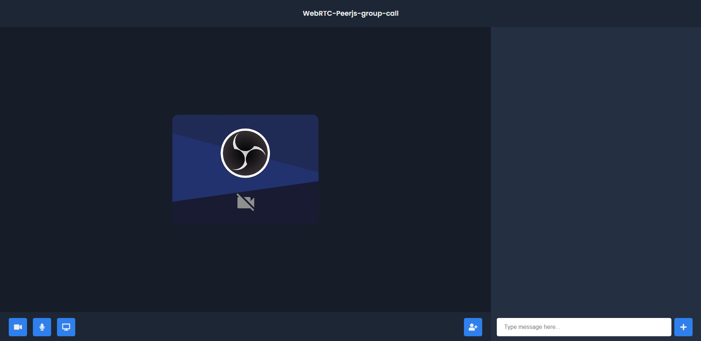

# WebRTC-Peerjs-group-call
WebRTC-Peerjs-group-call is a video group chat app that makes it easy to groups up with people you want to meet

## Max People
The maximum is 6 people, after that the cpu usage is too high.

### How to run the project?

1. Clone this repository in your local system.
2. Open the command prompt from your project directory and run the command `npm start` or if you have yarn on machine `yarn start`.
3. Go to your browser and type `http://127.0.0.1:5000/` in the address bar.
4. Hurray! That's it.

#### ToDo

- [x] Chat
- [x] Group call  
- [x] Screen Share  

- [ ] - Recreate the Front-end with React.

